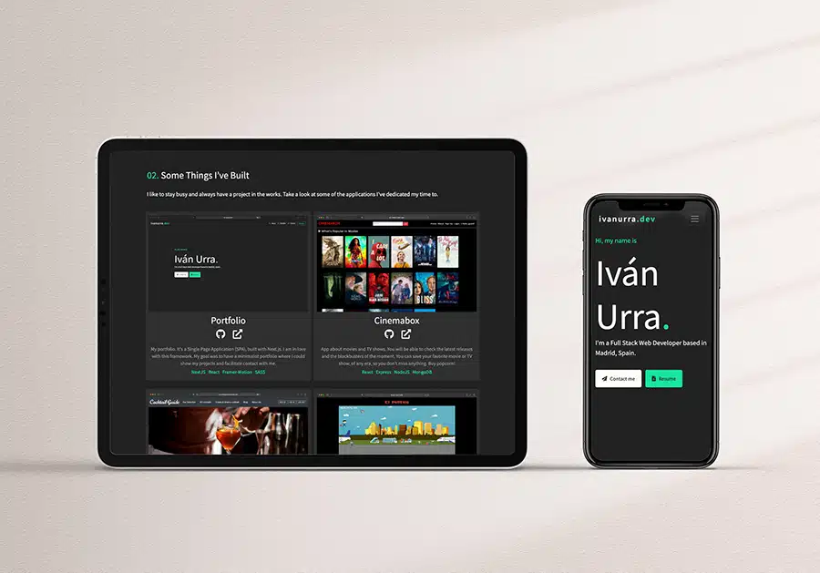

# PORTFOLIO - ivanurra.dev

My portfolio website. Built with NextJS.



## Getting Started 🚀

* Install all dependencies described in package.json:

```
$ npm install
```

* Run the development server:

```bash
npm run dev
# or
yarn dev
```

* Open [http://localhost:3000](http://localhost:3000) with your browser to see the result.

You can start editing the page by modifying `pages/index.js`. The page auto-updates as you edit the file.

## Deployment 📦

LIVE DEMO:

https://ivanurra.dev

## Built with 🛠️

* [NextJS](https://nextjs.org/) - Open-source React front-end development web framework.
* [React](https://reactjs.org/) - Open source Javascript library designed to create user interfaces on a single page.
* [Framer-Motion](https://www.framer.com/motion/) - A production-ready motion library for React.
* [Vercel](https://vercel.com/) - For deployment.

## Author ✒️

* **Iván Urra** - [ivanurra](https://github.com/ivanurra)

## License 📄

Copyright (c) 2021 Iván Urra

MIT License